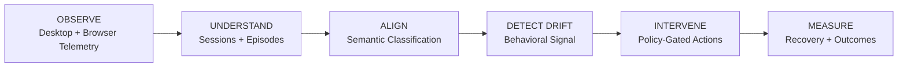

# Noema

**Personal Behavioral Intelligence for your desktop.**

Noema is a **private, local-first system that understands the difference between what you are doing and what you intended to do.**

It observes desktop and browser activity, turns raw telemetry into meaningful task episodes, classifies behavior, detects drift from your intended activity, intervenes when appropriate, and measures whether the intervention actually helped.

> **OBSERVE → UNDERSTAND → ALIGN → DETECT DRIFT → INTERVENE → MEASURE**

The core idea is simple:

**Your computer should understand your behavior without requiring your activity data to leave your machine.**

---

## Why Noema?

Most activity trackers answer:

> **"What application did I use?"**

Noema tries to answer:

> **"What was I actually doing, was it aligned with my intent, and what happened afterward?"**

A stream of browser tabs, application windows, and heartbeats is not meaningful behavior by itself.

Noema therefore does not treat every telemetry row as an activity. It builds **meaningful behavioral episodes** from continuous evidence, evaluates the quality of that evidence, and only then makes a behavioral judgment.

---

## Core Pipeline



### 1. OBSERVE

Noema collects desktop and browser telemetry from local sources.

```text
ActivityWatch
Native window collectors
Native input collectors
Firefox bridge
```

Raw events are normalized into a common event representation.

### 2. UNDERSTAND

Raw heartbeats are not treated as independent activities.

Noema:

* sessionizes continuous activity
* splits sessions around AFK periods
* merges related context
* builds meaningful task episodes
* scores continuity between observations
* evaluates evidence quality

The result is a higher-level representation of behavior:

```text
Raw telemetry
     ↓
Activity sessions
     ↓
Meaningful episodes
     ↓
Behavioral observations
```

### 3. ALIGN

Episodes are classified semantically using a hosted model when enabled.

Each episode receives:

* behavioral category
* confidence
* evidence quality
* classification status

Classification is deliberately conservative.

**Weak evidence cannot magically become a confident behavioral verdict.**

Failed model calls remain `pending` or `failed`. Noema never invents a classification simply because an inference request failed.

### 4. DETECT DRIFT

Episodes are aggregated into behavioral signals:

```text
FOCUSED
DISTRACTED
IDLE
```

Noema also runs an independent realtime detection lane.

```text
Rolling behavior window
        ↓
Local candidate score
        ↓
Hysteresis
        ↓
Fast verification
        ↓
Policy evaluation
```

This realtime path operates independently from the slower semantic classification pipeline.

### 5. INTERVENE

Classification alone cannot trigger an intervention.

An intervention must pass through a **policy gate**.

Possible actions include:

* notification
* contextual intervention
* meme
* holdout experiment

The policy layer handles:

* confidence requirements
* cooldowns
* de-escalation
* actionable distraction thresholds

The objective is not to constantly interrupt the user.

**The objective is to intervene only when the evidence justifies it.**

### 6. MEASURE

Noema tracks what happened after an intervention.

This allows the system to ask:

> Did the intervention actually help the user recover?

That closes the loop.

---

# Key Features

### Meaningful episodes, not row counting

Raw watcher heartbeats are sessionized and merged into meaningful task episodes using continuity scoring.

When browser domain evidence is unavailable, evidence-quality handling prevents fragmented tab activity from producing meaningless session explosions.

### Evidence quality is deterministic

Every episode receives an evidence rating:

```text
STRONG
MODERATE
WEAK
ABSENT
```

The rating is derived from observed signals such as:

```text
Application
Window title
Browser domain
URL
```

The model does not decide the evidence quality.

Thin evidence forces conservative behavior.

### Honest AI classification

Noema uses chunked, token-budgeted classification requests.

Failures remain:

```text
pending
failed
```

A failed model request does **not** become a fabricated label.

### Behavioral intelligence

Meaningful episodes roll up into:

```text
FOCUSED
DISTRACTED
IDLE
```

with associated focus and distraction scores.

### Policy-gated interventions

Noema separates:

```text
Classification
      ↓
Behavioral signal
      ↓
Policy
      ↓
Intervention
```

This prevents a single uncertain classification from immediately causing an action.

### Independent realtime detection

The realtime lane operates on a 60-second behavioral window and does not depend on the 10-minute semantic classification scheduler.

It uses:

```text
Candidate score
    ↓
Hysteresis
    ↓
Fast verification
    ↓
Intervention
```

Fast verification occurs on entry rather than continuously.

### Presence is not focus

AFK is determined from **input timing**.

Window focus is not treated as proof of presence.

Idle activity forms its own timeline category and is excluded from semantic classification.

### Local dashboard

Noema includes a local React dashboard served directly by the daemon.

```text
http://127.0.0.1:8765
```

The dashboard exposes:

* activity timeline
* behavioral verdicts
* evidence quality
* classification queue
* quotas
* model results
* realtime detector status
* daemon health

### Observable model usage

Every model invocation can be tracked through the local quota and telemetry ledger.

Recorded metadata includes:

```text
Provider
Model
Purpose
Pipeline
Token usage
Latency
Retries
Fallback depth
```

Unknown quota or token values remain unknown rather than being fabricated.

### Privacy by construction

Noema is designed around a **local-first architecture**.

The following remain on your machine:

```text
SQLite database
Logs
Quota ledger
Environment configuration
Raw telemetry
```

When hosted inference is enabled, only compact per-session evidence is sent to the model.

Realtime verification sends compact behavioral summaries rather than the underlying raw telemetry.

For fully local inference:

```text
NOEMA_PROVIDER=ollama
```

with hosted API keys unset.

See [`PRIVACY.md`](PRIVACY.md) for the complete data-flow policy.

---

# Architecture

```text
                    ┌─────────────────────┐
                    │   Telemetry Sources │
                    │                     │
                    │ ActivityWatch       │
                    │ Native Collectors   │
                    │ Firefox Bridge      │
                    └──────────┬──────────┘
                               │
                               ▼
                    ┌─────────────────────┐
                    │       domain/       │
                    │                     │
                    │ Activity            │
                    │ Presence            │
                    │ Sessions            │
                    │ Meaningful Episodes │
                    │ Classification      │
                    │ Behavior            │
                    └──────────┬──────────┘
                               │
                               ▼
                  ┌─────────────────────────┐
                  │     application/        │
                  │                         │
                  │ Pipeline                │
                  │ Classification         │
                  │ Realtime Detection     │
                  │ Autonomous Actions     │
                  └────────────┬────────────┘
                               │
              ┌────────────────┼────────────────┐
              ▼                ▼                ▼
        ┌──────────┐     ┌──────────┐    ┌──────────────┐
        │ runtime/ │     │   api/   │    │ observability│
        │          │     │          │    │              │
        │ Workers  │     │ REST API │    │ Metrics      │
        │ Ingest   │     │          │    │ Benchmarks   │
        │ Semantic │     │          │    │ Quotas       │
        │ Realtime │     │          │    │              │
        └──────────┘     └─────┬────┘    └──────────────┘
                               │
                               ▼
                         ┌───────────┐
                         │    web/   │
                         │ Dashboard │
                         └───────────┘
```

---

# Two Processing Lanes

Noema deliberately separates **semantic understanding** from **realtime intervention**.

| Lane              | Purpose                                          | Cadence |
| ----------------- | ------------------------------------------------ | ------: |
| Semantic pipeline | Build episodes and perform deeper classification | ~10 min |
| Realtime pipeline | Detect behavioral drift quickly                  | ~60 sec |

The realtime lane does not wait for the semantic pipeline to finish.

This separation allows Noema to combine **rich semantic understanding** with **low-latency behavioral detection**.

---

# Model Providers

The default classification chain is **Gemini-only**.

The system supports a ranked Flash-model chain with bounded, token-aware batching.

Configuration includes:

```text
NOEMA_GEMINI_MODELS
NOEMA_MAX_PER_RUN
NOEMA_FAST_MODEL_TIMEOUT_SECONDS
NOEMA_PROVIDER
```

An Ollama-based local inference path is also available:

```powershell
$env:NOEMA_PROVIDER="ollama"
```

with the local model server running at:

```text
http://127.0.0.1:11434
```

An OpenRouter integration exists in the codebase but is disabled by default.

---

# Installation

Clone the repository and install Noema:

```powershell
pip install .
```

Then:

```powershell
python -m noema --help
```

or:

```powershell
noema --help
```

For development without installing the package:

```powershell
$env:PYTHONPATH="src"
python -m noema
```

---

# Configuration

Copy the example configuration:

```text
.env.example
```

to:

```text
.env
```

Set the required provider configuration.

For Gemini:

```text
GEMINI_API_KEY=...
```

Configuration uses the canonical:

```text
NOEMA_*
```

prefix.

Historical `AI_ACTIVITY_OS_*` names remain accepted by the configuration loader.

**Never commit `.env` or API keys.**

---

# Running Noema

Start the daemon:

```powershell
python -m noema
```

Run a single pipeline cycle:

```powershell
python -m noema --once
```

Run deterministic benchmarks:

```powershell
python -m noema benchmark full --mock
```

View observability information:

```powershell
python -m noema metrics summary
```

Open the local dashboard:

```text
http://127.0.0.1:8765
```

---

# Rebuilding Inference

Noema can rebuild derived episodes and classifications without touching raw telemetry.

Preview the operation:

```powershell
python rerun_inference.py --dry-run
```

Run the rebuild:

```powershell
python rerun_inference.py --yes
```

A timestamped backup is created before derived data is removed.

---

# API

The daemon exposes a local API on:

```text
127.0.0.1:8765
```

| Endpoint                                       | Purpose                              |
| ---------------------------------------------- | ------------------------------------ |
| `GET /`                                        | Local dashboard                      |
| `GET /api/daemon/health`                       | Daemon and worker health             |
| `GET /api/dashboard/summary?range=today`       | Timeline and calendar totals         |
| `GET /api/dashboard/recent-activity?range=24h` | Recent sessions and verdicts         |
| `GET /api/meaningful-sessions`                 | Meaningful behavioral episodes       |
| `GET /api/classifications`                     | Stored classifications               |
| `GET /api/classification/status`               | Classification queue and quota state |
| `POST /api/ai/run`                             | Run a manual classification pass     |
| `GET /api/debug/quotas`                        | Model quota ledger                   |
| `GET /api/realtime/status`                     | Realtime detector state              |
| `GET /api/presence/current`                    | Current presence state               |

---

# Testing

Run the Python test suite:

```powershell
python -m pytest tests -q
```

Build the dashboard:

```powershell
Push-Location web
npm run lint
npm run build
Pop-Location
```

CI runs the test suite with mocks and does not require:

* API keys
* ActivityWatch
* Ollama

Live provider testing is intentionally separate.

---

# Project Structure

```text
src/noema/
├── domain/
│   ├── activity/
│   ├── presence/
│   ├── sessions/
│   ├── meaningful_sessions/
│   ├── classification/
│   └── behavior/
│
├── application/
│   ├── pipeline/
│   ├── classification/
│   ├── realtime/
│   └── autonomous/
│
├── runtime/
│   ├── ingest/
│   ├── semantics/
│   ├── behavior/
│   ├── outcomes/
│   └── realtime/
│
├── api/
├── infrastructure/
├── observability/
└── web/
```

The ActivityWatch adapter remains intentionally small and **read-only**. Native collectors are the primary telemetry path.

---

# Design Principles

Noema is built around a few non-negotiable principles.

### 1. Evidence before inference

Observed signals come first. Model interpretation comes second.

### 2. Uncertainty stays uncertainty

Missing evidence does not become confidence.

Failed inference does not become a fabricated verdict.

### 3. Episodes over events

Behavior is represented as meaningful temporal episodes rather than isolated telemetry rows.

### 4. Classification does not equal action

Every intervention passes through a separate policy layer.

### 5. Presence does not equal focus

Input activity determines presence. Application focus does not.

### 6. Local by default

Raw behavioral telemetry should remain local whenever possible.

### 7. Measure the intervention

An intervention is not successful because it fired.

It is successful only if the user's subsequent behavior shows recovery.

---

# Documentation

More detailed documentation is available in:

* [`PRIVACY.md`](PRIVACY.md) for the privacy and external-data policy
* [`SECURITY.md`](SECURITY.md) for vulnerability reporting
* [`src/noema/docs/FEATURES.md`](src/noema/docs/FEATURES.md) for feature-level documentation
* [`src/noema/docs/ROADMAP.md`](src/noema/docs/ROADMAP.md) for planned improvements
* [`LICENSE.txt`](LICENSE.txt) for licensing information
* [`CITATION.cff`](CITATION.cff) for citation metadata

---

# Status

Noema is an actively developed research-oriented system exploring **personal behavioral intelligence, activity understanding, intent alignment, and adaptive intervention**.

The architecture is intentionally modular so that telemetry collection, semantic understanding, behavioral inference, policy, intervention, and measurement can evolve independently.

---

## The Goal

Noema is not trying to build another screen-time tracker.

It is trying to build a system that can understand:

```text
What am I doing?
       ↓
What was I intending to do?
       ↓
Are they aligned?
       ↓
If not, how confident are we?
       ↓
Should the system intervene?
       ↓
Did the intervention work?
```

**That is the behavioral intelligence loop Noema is built around.**
