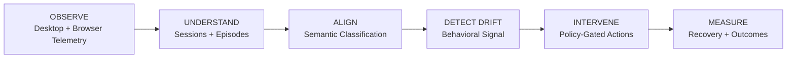

# Noema

[](https://github.com/Nithin031/Noema/actions/workflows/test.yml)
[](https://github.com/Nithin031/Noema/blob/main/LICENSE.txt)
[](https://github.com/Nithin031/Noema/blob/main/pyproject.toml)

**Personal Behavioral Intelligence — local-first.**

> Understand what you're doing. Compare it to what you meant.

Most productivity software can tell you where your time went.

Noema is interested in a harder question:

> **"What was I actually doing, and was it what I intended to do?"**

A stream of application windows, browser tabs, and heartbeats is not behavior by
itself. Noema turns raw desktop telemetry into **semantic activity episodes**,
compares them against your stated intent, watches for sustained drift, intervenes
only when the evidence justifies it, and measures whether the intervention helped.

> **OBSERVE → UNDERSTAND → ALIGN → DETECT DRIFT → INTERVENE → MEASURE**

Telemetry is the input. Behavioral intelligence is the product.

---

## What Noema is

Noema is a **local-first Personal Behavioral Intelligence system**. It is concerned
with:

- what the computer observes (foreground windows, input presence, browser context)
- what the user appears to be doing (semantic activity episodes)
- what the user intended to do (explicit goals / intent)
- whether observed activity aligns with that intent (goal alignment)
- sustained behavioral drift (distraction that persists, not a single tab)
- restrained intervention (policy-gated, cooldown-bound, measurable)
- whether the intervention actually worked (recovery measurement)

Noema is **not** an activity tracker, a time tracker, a website blocker, a focus
timer, a dashboard product, a chatbot, or an LLM wrapper. Those categories describe
tools that count, block, or chat. Noema tries to *understand* — and to stay honest
about what it cannot know.

---

## How the pipeline works

Raw activity is not semantic activity. Semantic activity is not intent.
Intent is not alignment. Alignment is not behavioral drift. Drift is not an
intervention. An intervention is not an outcome. Noema keeps each of these
distinct — that separation is the architecture.



### 1. OBSERVE — telemetry in, nothing else

Noema observes the local machine through its own native collectors (foreground
window + input presence on Windows) and an optional browser bridge endpoint that
a browser extension client can push tab metadata to.

```text
Telemetry
    ↓
Normalization (canonical events, privacy filter first)
    ↓
Sessions (continuous stretches of same-context activity)
    ↓
Semantic episodes (task-level units built by continuity scoring)
    ↓
Classification (behavioral category + confidence + evidence quality)
    ↓
Intent / Alignment (episode vs. your stated goal: aligned / misaligned / unknown)
    ↓
Behavior (FOCUSED / DISTRACTED / IDLE signals over rolling windows)
    ↓
Intervention (policy-gated, cooldown-bound actions)
    ↓
Outcome (did behavior recover afterward?)
```

### 2. UNDERSTAND — episodes, not row counting

Raw heartbeats are never treated as independent activities. Noema sessionizes
continuous activity, splits sessions around AFK periods, and merges related
context into **semantic activity episodes** using continuity scoring (time,
transition, topic, project, intent, confidence). When browser domain evidence is
unavailable, evidence-quality handling keeps fragmented tab activity from
exploding into meaningless one-second episodes.

### 3. CLASSIFY — conservative semantic classification

Episodes are classified using a model when enabled. Gemini is the default
hosted inference path. Ollama can be selected for fully local inference.
Each episode receives a behavioral category, confidence, evidence quality
(`STRONG / MODERATE / WEAK / ABSENT`), and classification status. Evidence
quality is separate from confidence, and uncertainty remains `unknown`:
weak evidence cannot become a confident verdict, and failed model calls stay
`pending`/`failed` instead of becoming fabricated labels.

### 4. ALIGN — episodes compared against intent

Classification describes what the episode appears to be; alignment compares it
against your stated goal. Goal alignment is three-valued — `aligned`,
`misaligned`, or `unknown` — and deliberately conservative: productive does not
automatically mean aligned, distractive does not automatically mean misaligned,
and a mere lack of lexical overlap never means misaligned on its own.

### 5. DETECT DRIFT — two independent lanes

| Lane | Purpose | Cadence |
| ---- | ------- | ------: |
| Semantic pipeline | Build episodes, classify, align to intent | ~20 min |
| Realtime pipeline | Detect behavioral drift quickly | ~60 sec |

The realtime lane (rolling behavior window → candidate score → hysteresis → fast
verification → policy evaluation) never waits for the semantic pipeline. Drift
requires an *explicit* misaligned verdict — uncertainty never drifts.

### 6. INTERVENE — restraint by design

Classification alone cannot trigger an intervention — intervention requires
accumulated evidence. Every action passes a policy
gate (confidence requirements, cooldowns, AFK veto, actionable-evidence
thresholds, ineffective-streak backoff). The objective is not to interrupt
constantly — it is to intervene only when the evidence justifies it.

### 7. MEASURE — did it help?

Noema records what happened after each intervention. An intervention counts as
successful only if subsequent behavior shows recovery — not because it fired.

---

## Design Principles

1. Activity is evidence, not meaning.
2. Intent gives activity context.
3. Uncertainty remains uncertainty.
4. Presence is not productivity.
5. Episodes are more meaningful than isolated events.
6. Evidence quality is separate from confidence.
7. Classification failure is not a semantic verdict.
8. Intervention requires accumulated evidence.
9. Every intervention should be measurable.
10. Local-first is a system property, not a marketing phrase.

---

## What exists today — and what does not

**Shipped and working:** native Windows telemetry collectors (primary path),
AFK/presence detection from input timing, sessionization, semantic episodes with
evidence quality, Gemini-hosted or Ollama-local classification, three-valued goal
alignment, behavior engine + realtime drift detection, policy-gated interventions
with outcome/recovery tracking, local REST API, and a bundled static dashboard
served by the daemon at `http://127.0.0.1:8765`.

**Not included in this repository:** a React frontend (the daemon serves the
bundled static dashboard; an optional `web/dist/` build would take precedence if
you add one), a browser-extension client (the daemon-side bridge endpoint ships;
the extension itself does not), and cross-platform native collectors (non-Windows
platforms use the optional ActivityWatch adapter). See
[Relationship to ActivityWatch](#relationship-to-activitywatch).

---

## Installation

```powershell
pip install .
```

Then:

```powershell
python -m noema --help
```

or:

```powershell
noema --help
```

For development without installing the package:

```powershell
$env:PYTHONPATH="src"
python -m noema
```

## Configuration

Copy `.env.example` to `.env` and set the provider configuration. For Gemini:

```text
GEMINI_API_KEY=...
```

Configuration uses the canonical `NOEMA_*` prefix. Historical `AI_ACTIVITY_OS_*`
names remain accepted by the configuration loader. **Never commit `.env` or API keys.**

For fully local inference:

```text
NOEMA_PROVIDER=ollama
```

with hosted API keys unset.

## Running Noema

Start the daemon:

```powershell
python -m noema
```

Run a single pipeline cycle:

```powershell
python -m noema --once
```

Show live native telemetry (no server, database, or model needed):

```powershell
python -m noema telemetry
```

Run deterministic benchmarks:

```powershell
python -m noema benchmark full --mock
```

View observability information:

```powershell
python -m noema metrics summary
```

Open the local dashboard:

```text
http://127.0.0.1:8765
```

## Rebuilding inference

Derived episodes and classifications can be rebuilt without touching raw telemetry:

```powershell
python rerun_inference.py --dry-run
python rerun_inference.py --yes
```

A timestamped backup is created before derived data is removed.

---

## API

The daemon exposes a local loopback-only API on `127.0.0.1:8765`.

| Endpoint | Purpose |
| -------- | ------- |
| `GET /` | Local dashboard |
| `GET /api/daemon/health` | Daemon and worker health |
| `GET /api/dashboard/summary?range=today` | Timeline and calendar totals |
| `GET /api/dashboard/recent-activity?range=24h` | Recent sessions and verdicts |
| `GET /api/meaningful-sessions` | Semantic activity episodes |
| `GET /api/classifications` | Stored classifications |
| `GET /api/classification/status` | Classification queue and quota state |
| `POST /api/ai/run` | Run a manual classification pass |
| `GET /api/debug/quotas` | Model quota ledger |
| `GET /api/realtime/status` | Realtime detector state |
| `GET /api/presence/current` | Current presence state |

Quota figures served by the API are **local estimates** (`isLocalEstimate: true`
with an explicit `quotaScope`), never provider-authoritative claims.

---

## Privacy

Noema is local-first: the SQLite database, logs, quota ledger, configuration, and
raw telemetry stay on your machine, and the local API binds to loopback only.

When hosted inference is enabled, only compact, privacy-filtered per-session
evidence (application name, window title/domain evidence for the sessions in the
current batch when available, and the task instruction) is sent to the model — never file
contents, keystrokes, screenshots, or full history. Realtime verification sends
compact behavioral summaries, never raw event streams.

See [`PRIVACY.md`](PRIVACY.md) for the complete data-flow policy and
[`SECURITY.md`](SECURITY.md) for vulnerability reporting.

---

## Project structure

```text
src/noema/
├── domain/          # pure behavioral logic: activity, presence, sessions,
│                    # semantic episodes, intent/alignment, behavior,
│                    # intervention, privacy — no I/O here
├── application/     # pipeline, classification, realtime detection,
│                    # autonomous orchestration
├── infrastructure/  # adapters: native collectors, ActivityWatch adapter,
│                    # providers, database, browser bridge, ollama, sync
├── runtime/         # daemon, workers, single-instance lock, watchdog
├── api/             # local HTTP API + bundled dashboard (api/dashboard/)
├── cli/             # `noema` console entry points
├── config/          # settings loader (NOEMA_* env)
├── observability/   # metrics, benchmarks, quota/telemetry ledger
└── docs/            # architecture, features, roadmap, licensing, status

tests/               # unit, integration, regression, providers, realtime
```

## Relationship to ActivityWatch

ActivityWatch is a **third-party ecosystem and interoperability reference** — it
is not Noema's product identity and Noema is not an ActivityWatch fork, wrapper,
or extension.

Concretely:

- Noema's primary telemetry path is its own **independent native implementation**
  (`src/noema/infrastructure/activity_sources/native_*.py`, standard library
  only). No ActivityWatch source code is copied or adapted into Noema.
- A small **read-only** adapter
  (`src/noema/infrastructure/activity_sources/activitywatch/`) can consume a
  local ActivityWatch instance as an *optional* compatibility source where
  supported. Native collectors remain the primary path and keep working with
  ActivityWatch stopped.
- Full provenance and licensing details live in
  [`src/noema/docs/licensing/activitywatch.md`](src/noema/docs/licensing/activitywatch.md)
  and [`THIRD_PARTY_NOTICES.md`](THIRD_PARTY_NOTICES.md). Both projects are
  MPL-2.0.

---

## Testing

```powershell
python -m pytest tests -q
```

CI runs the Python suite with mocks only — no API keys, no ActivityWatch, no
Ollama required. Live provider testing is intentionally separate.

## Documentation

- [`PRIVACY.md`](PRIVACY.md) — privacy and external-data policy
- [`SECURITY.md`](SECURITY.md) — vulnerability reporting
- [`CONTRIBUTING.md`](CONTRIBUTING.md) — development setup and contribution rules
- [`src/noema/docs/FEATURES.md`](src/noema/docs/FEATURES.md) — feature-level documentation
- [`src/noema/docs/ROADMAP.md`](src/noema/docs/ROADMAP.md) — planned improvements
- [`LICENSE.txt`](LICENSE.txt) — licensing information (MPL-2.0)
- [`CITATION.cff`](CITATION.cff) — citation metadata

## Status

Noema is an actively developed research-oriented system exploring **personal
behavioral intelligence: activity understanding, intent alignment, drift
detection, restrained intervention, and outcome measurement**.

## License

Noema is licensed under the Mozilla Public License 2.0 — see
[`LICENSE.txt`](LICENSE.txt). Third-party notices live in
[`THIRD_PARTY_NOTICES.md`](THIRD_PARTY_NOTICES.md).

If you use or refer to Noema in research, please cite it per
[`CITATION.cff`](CITATION.cff).
