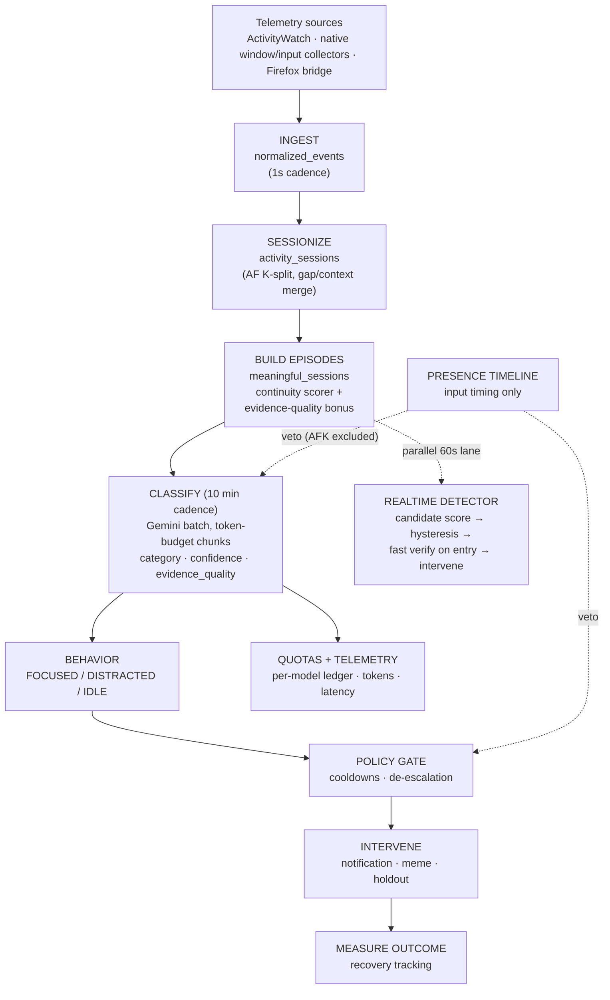

# Noema

Noema is a private, local-first **Personal Behavioral Intelligence** system. It
is concerned with the difference between *observed* activity and *intended*
activity: it observes desktop and browser telemetry, understands it, aligns it
with intent, detects drift, intervenes under policy, and measures the outcome.

Product loop: **OBSERVE → UNDERSTAND → ALIGN → DETECT DRIFT → INTERVENE →
MEASURE.**

## Features

- **Episode building, not row counting.** Raw watcher heartbeats are
  sessionized, then merged into *meaningful sessions* (task episodes) by a
  continuity scorer. When browser domain evidence is missing, an
  evidence-quality bonus keeps fragmented tab activity from exploding into
  dozens of meaningless sessions.
- **Evidence quality on every verdict.** Each episode carries a deterministic
  `strong / moderate / weak / absent` rating computed from observed signals
  (app, title, domain, URL) — never by the model. Thin evidence forces
  low-confidence `neutral`; it can never become `distractive`.
- **Honest classification.** Gemini batch classifies episodes with chunked,
  token-budgeted requests. Failures stay `pending`/`failed` and are retried
  with backoff — a failed call never synthesizes a label.
- **Behavioral signal.** Episodes roll up into `FOCUSED / DISTRACTED / IDLE`
  observations with focus/distraction scores.
- **Policy-gated interventions.** Notifications, memes, and holdouts fire only
  on confirmed, actionable distraction with per-mode cooldowns and
  de-escalation. Classification alone can never trigger an action.
- **Independent realtime lane.** A 60-second loop (rolling behavior windows →
  local candidate score → hysteresis → fast-model verification on entry only)
  detects drift without touching the 10-minute semantic scheduler.
- **Presence is input, not focus.** AFK comes from input timing only; window
  focus is never presence. Idle time is excluded from classification and forms
  its own timeline bucket.
- **Local dashboard.** React app served from the daemon itself at
  `http://127.0.0.1:8765` — activity stream with verdict + evidence badges,
  pipeline queue, quotas, results, and realtime status.
- **Observable quotas and costs.** Per-model RPM/TPM/RPD ledger that survives
  restarts, token accounting with explicit estimates, benchmark harness with
  p50/p95, all queryable via API.
- **Privacy by construction.** SQLite, quota ledger, logs, and `.env` stay on
  your machine (gitignored). Only compact per-session evidence goes to a
  hosted model; realtime verification sends compact behavioral summaries.
  Details in `PRIVACY.md`.

## Workflow



See `src/noema/docs/FEATURES.md` for a per-feature deep dive and `src/noema/docs/ROADMAP.md`
for planned improvements.

## Architecture

```text
Telemetry sources (ActivityWatch adapter: read-only; native collectors: primary)
  -> domain/ (activity, presence, sessions, meaningful episodes, classification, behavior, ...)
  -> application/ (pipeline, classification, realtime, autonomous)
  -> runtime/ (ingest / semantics / behavior / outcomes / realtime workers)
  -> api/ + web/ (local dashboard)      observability/ (metrics, benchmarks)
```

## Setup

Install the package (from the repository root):

```powershell
pip install .
python -m noema --help
# or use the console script:
noema --help
```

For development without installing, set `PYTHONPATH`:

```powershell
$env:PYTHONPATH = "src"
python -m noema
```

Dependencies are stdlib-only except `google-genai` (Gemini transport
and token counting); `psutil` is optional (process-liveness probe with
a stdlib/Win32 fallback). Set `GEMINI_API_KEY` for hosted access (see
`.env.example`). Ollama is the local-only alternative
(`NOEMA_PROVIDER=ollama`, model at `http://127.0.0.1:11434`).

Run the daemon (from the repository root):

```powershell
python -m noema
```

Useful subcommands:

```powershell
python -m noema --once                        # one pipeline cycle, then exit
python -m noema benchmark full --mock         # deterministic benchmarks
python -m noema metrics summary               # observability summary
```

The daemon exposes its local API on `127.0.0.1:8765` and continues collecting
while semantic classification or retries are running. Configuration lives in
`.env` (see `.env.example`); canonical prefix is `NOEMA_*`, historical
`AI_ACTIVITY_OS_*` names remain accepted by the config loader.

To wipe derived results and rerun inference from scratch (raw telemetry is
never touched, a timestamped backup is taken first):

```powershell
python rerun_inference.py --dry-run   # preview counts
python rerun_inference.py --yes       # wipe + rebuild episodes + batch classify
```

## Providers

Default classification chain is **Gemini-only**: six ranked Flash models
(`NOEMA_GEMINI_MODELS`), newest-first bounded chunks
(`NOEMA_MAX_PER_RUN=60`, batch size 20), Ollama excluded
(`AI_ACTIVITY_OS_PROVIDER=gemini`). An OpenRouter free-tier exists in code
but ships disabled; the realtime fast path reuses the chain with short
timeouts (`NOEMA_FAST_MODEL_TIMEOUT_SECONDS`). Every model invocation records
provider, model, purpose, pipeline, tokens, latency, retries, and
fallback depth; failures stay `pending`/`failed` and never become
`neutral`. Unknown quota/token values stay unknown; no secrets are
recorded. See `PRIVACY.md` for what is (and is not) sent externally.

## Key API endpoints

| Endpoint | Purpose |
|---|---|
| `GET /` | Dashboard UI (served by the daemon) |
| `GET /api/daemon/health` | Status, provider chain, worker health |
| `GET /api/dashboard/summary?range=today` | Calendar totals + timeline |
| `GET /api/dashboard/recent-activity?range=24h` | Sessions with verdict + evidence |
| `GET /api/meaningful-sessions` | Task episodes (with `evidence_quality`) |
| `GET /api/classifications` | Stored verdicts |
| `GET /api/classification/status` | Queue: pending/failed/classified, quota |
| `POST /api/ai/run` | Manual classification pass |
| `GET /api/debug/quotas` | Per-model quota ledger |
| `GET /api/realtime/status` | Realtime tracker state |
| `GET /api/presence/current` | Presence snapshot |

## Privacy

Local-first: the SQLite database, quota ledger, logs, and `.env` stay
on your machine (gitignored). Only compact per-session evidence goes
to a hosted model when hosted tiers are enabled; realtime verification
sends only compact behavioral summaries. `NOEMA_PROVIDER=ollama` with
hosted keys unset keeps all inference on-device. Details in
`PRIVACY.md`; vulnerability reports in `SECURITY.md`.

## Logs & Cleanup

To ensure Noema is launch-ready and running with a clean state, you can clear its log files. The daemon logs its activity to the `logs/` directory (e.g., `logs/daemon.log`). You can safely delete these files at any time:

```powershell
Remove-Item -Path .\logs\* -Recurse -Force
```

## Testing

```powershell
python -m pytest tests -q
Push-Location web
npm run lint
npm run build
Pop-Location
```

Public CI (`.github/workflows/test.yml`) runs the same suite with
mocks only — no API keys, no ActivityWatch, no Ollama. Live provider
checks are manual and separate.

The ActivityWatch adapter in
`src/noema/infrastructure/activity_sources/activitywatch/` remains
intentionally small and read-only because it speaks the existing local
telemetry protocol. The upstream license and citation metadata are retained
in `LICENSE.txt` and `CITATION.cff`.
# Noema-Activity-Tracker-

