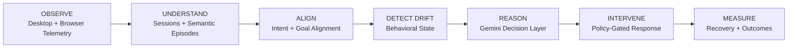
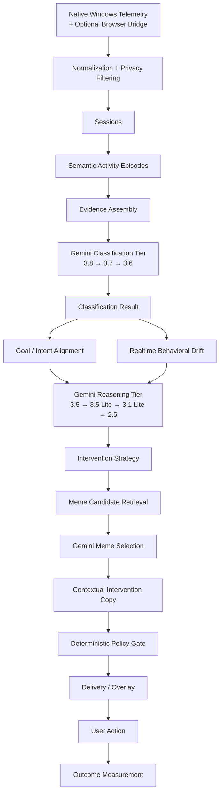

Noema


Personal Behavioral Intelligence — local-first.
> Understand what you're doing. Compare it to what you meant.
Most productivity software can tell you where your time went.
Noema is interested in a harder question:
> **"What was I actually doing, and was it what I intended to do?"**
A stream of application windows, browser tabs, presence signals, and heartbeats is not behavior by itself. Noema turns raw desktop telemetry into semantic activity episodes, compares those episodes against stated intent, detects sustained behavioral drift, reasons about whether an intervention is appropriate, chooses an appropriate response, and measures whether that intervention actually helped.
```text
OBSERVE
   ↓
UNDERSTAND
   ↓
ALIGN
   ↓
DETECT DRIFT
   ↓
REASON
   ↓
INTERVENE
   ↓
MEASURE
```
Telemetry is the input. Behavioral intelligence is the product.
---
What Noema is
Noema is a local-first Personal Behavioral Intelligence system.
It models the relationship between:
what the computer observes
what the user appears to be doing
what the user intended to do
whether current activity aligns with that intent
whether misalignment persists long enough to constitute behavioral drift
whether an intervention is warranted
what intervention is appropriate
whether the user responds
whether behavior recovers afterward
The central distinction is:
```text
Activity
   ≠
Meaning
   ≠
Intent
   ≠
Alignment
   ≠
Drift
   ≠
Intervention
   ≠
Outcome
```
Noema keeps these concepts separate throughout the system.
Noema is not
Noema is not primarily:
an activity tracker
a time tracker
a website blocker
a focus timer
a screen-time dashboard
a chatbot
an autonomous computer agent
an LLM wrapper
Those systems generally focus on counting, blocking, reminding, or chatting.
Noema is designed around behavioral interpretation and closed-loop intervention.
---
Core loop

The loop is intentionally closed.
Noema does not consider an intervention successful simply because it was displayed.
A meaningful intervention has a lifecycle:
```text
Detection
   ↓
Reasoning
   ↓
Decision
   ↓
Response Selection
   ↓
Delivery
   ↓
User Action
   ↓
Subsequent Behavior
   ↓
Recovery
   ↓
Outcome
```
---
Architecture
Noema separates semantic intelligence from deterministic execution.

The architecture deliberately assigns different responsibilities to the model and to Noema itself.
Gemini provides semantic intelligence
Gemini is responsible for model-based reasoning such as:
semantic interpretation
intervention reasoning
intervention strategy
severity
response class
tone
meme intent
meme candidate ranking
contextual intervention copy
auxiliary semantic enrichment
Noema remains deterministic where determinism matters
Noema itself controls:
telemetry collection
normalization
privacy filtering
sessionization
evidence boundaries
persistence
state machines
cooldowns
AFK vetoes
break suppression
policy gates
delivery availability
model failure semantics
database writes
outcome attribution
The principle is:
> **Gemini decides what makes semantic sense. Noema decides what is permitted and how it is executed.**
---
1. OBSERVE — telemetry without interpretation
Noema observes the local machine through its own native telemetry implementation.
On Windows this includes:
foreground application/process
foreground window title
process identity
input-presence/AFK state
heartbeat continuity
An optional browser bridge can provide browser tab metadata through the local API.
The telemetry layer is designed to remain useful even when ActivityWatch is not running.
```text
Windows
   ↓
Native foreground telemetry
   +
Native presence telemetry
   +
Optional browser bridge
   ↓
Canonical activity events
```
Noema does not treat raw telemetry as semantic behavior.
A window title, application name, or browser tab is evidence, not a conclusion.
---
2. PRIVACY — filter before persistence and inference
Privacy filtering happens before sensitive activity is persisted or sent to hosted inference.
Noema does not collect or send:
keystrokes
screenshots
file contents
arbitrary filesystem contents
complete browser history
raw event streams to Gemini
Hosted inference receives bounded, privacy-filtered evidence relevant to the current reasoning task.
Depending on the task, this can include:
application identity
window title
browser domain evidence when available
semantic episode context
goal/task instruction
bounded recent behavioral context
The system is designed around data minimization rather than collecting everything and filtering later.
See `PRIVACY.md`.
---
3. UNDERSTAND — sessions and semantic episodes
Raw heartbeats are not treated as independent activities.
Noema first constructs continuous sessions and then groups related activity into semantic episodes.
Episodes use continuity evidence such as:
temporal continuity
application transitions
topic continuity
project/context continuity
intent context
classification confidence
evidence quality
The objective is to answer:
> "What coherent thing does this sequence of activity appear to represent?"
rather than:
> "Which application was active at 10:31:04?"
This prevents the behavioral model from being dominated by meaningless one-second activity fragments.
---
4. CLASSIFICATION — Gemini classification tier
Classification is a dedicated model tier.
The current classification chain is:
```text
Gemini 3.8 Flash
      ↓
Gemini 3.7 Flash
      ↓
Gemini 3.6 Flash
```
These models are reserved for classification jobs.
Classification can determine:
semantic activity category
productive / distractive / neutral state
semantic activity interpretation
classification confidence
evidence quality
classification status
The classification result is distinct from intervention reasoning.
For example:
```json
{
  "category": "distractive",
  "confidence": 0.91,
  "evidence_quality": "STRONG"
}
```
does not automatically mean:
```text
SHOW INTERVENTION
```
It means the semantic classification is evidence for a later behavioral decision.
Classification failure is not a classification result
Noema explicitly distinguishes:
```text
DISTRACTIVE
NEUTRAL
PRODUCTIVE
```
from:
```text
CLASSIFICATION_UNAVAILABLE
RATE_LIMITED
TIMEOUT
INVALID_OUTPUT
PROVIDER_ERROR
```
A failed model call must never silently become a semantic label.
For example:
```text
429
```
must not become:
```text
NEUTRAL 40%
```
When the entire classification tier is unavailable, Noema surfaces an explicit unavailable state and keeps the underlying classification honest.
---
5. MODEL TIERS
Noema uses separate Gemini tiers for different classes of work.
Classification tier
```text
Gemini 3.8 Flash
        ↓
Gemini 3.7 Flash
        ↓
Gemini 3.6 Flash
```
These models are reserved for classification.
They are not used for:
meme selection
intervention copy
intervention strategy
auxiliary enrichment
Reasoning tier
Non-classification reasoning uses:
```text
Gemini 3.5 Flash
        ↓
Gemini 3.5 Flash Lite
        ↓
Gemini 3.1 Flash Lite
        ↓
Gemini 2.5 Flash
```
This tier handles:
intervention reasoning
response strategy
intervention tone
severity
meme intent
meme selection
contextual copy
other non-classification reasoning
The separation is enforced in the provider layer. Cross-tier substitution is rejected rather than silently consuming quota from the wrong model class.
Why the tiers are separated
Keeping the tiers separate allows Noema to:
control quota usage
reason about latency independently
observe model usage by purpose
prevent accidental model substitution
reserve the strongest classification models for classification
use higher-RPD models for auxiliary workloads
---
6. ALIGN — intent is separate from classification
Classification answers:
> "What does this activity appear to be?"
Intent answers:
> "What did the user intend to do?"
Alignment relates the two.
Noema uses:
```text
ALIGNED
MISALIGNED
UNKNOWN
```
The alignment model is intentionally conservative.
Important rules
```text
PRODUCTIVE
    ≠ automatically ALIGNED

DISTRACTIVE
    ≠ automatically MISALIGNED

NO lexical overlap
    ≠ MISALIGNED

INSUFFICIENT evidence
    → UNKNOWN
```
A lack of evidence is not evidence of misalignment.
---
7. DETECT DRIFT — behavioral state
Behavioral drift is not a single bad activity.
Noema uses accumulated evidence over rolling windows.
There are two complementary processing lanes.
Lane	Purpose	Approximate cadence
Semantic pipeline	Episodes, classification, alignment	~20 min
Realtime pipeline	Behavioral drift detection	~60 sec
The realtime lane uses:
```text
Rolling behavior windows
        ↓
Deterministic drift score
        ↓
Hysteresis
        ↓
Fresh-candidate verification
        ↓
Gemini intervention reasoning
```
The realtime detector can identify a candidate quickly without waiting for the slower semantic pipeline.
A candidate does not automatically become an intervention.
---
8. REASON — Gemini intervention intelligence
Once the deterministic realtime system has sufficient evidence, the reasoning tier is asked to interpret the situation.
The reasoning model receives bounded context such as:
current semantic activity
active goal
alignment
behavioral state
drift score
recent episodes
recent interventions
recent outcomes
break state
bounded feedback
The reasoning model can decide:
```text
Should Noema intervene?
```
and, if yes:
```text
What kind of intervention?
What severity?
What tone?
Should a meme be used?
What is the meme intent?
What response strategy fits?
```
The model can also explicitly decline:
```text
DO_NOT_INTERVENE
```
A distractive classification does not force an intervention.
---
9. INTERVENTION REASONING
Conceptually:
```text
CLASSIFICATION
     ↓
DISTRACTIVE
     ↓
Behavioral evidence
     +
Goal
     +
Alignment
     +
History
     ↓
GEMINI REASONING
     ↓
INTERVENTION DECISION
```
A decision contains structured information such as:
```json
{
  "should_intervene": true,
  "type": "MEME_NUDGE",
  "severity": 3,
  "tone": "PLAYFUL",
  "response_class": "PROCRASTINATION_CALLOUT",
  "use_meme": true,
  "meme_intent": "PROCRASTINATION_CALLOUT",
  "confidence": 0.87
}
```
This is a structured decision contract.
Noema does not expose private model chain-of-thought.
The product exposes concise decision summaries and evidence-based rationales where appropriate.
---
10. MEME INTELLIGENCE
Noema includes a local meme asset corpus containing 6,992 dataset rows, of which 6,991 valid image assets were ingested.
The architecture deliberately separates:
```text
Meme Asset
    ≠
Response
    ≠
Intervention
```
A meme asset is an image and its metadata.
A response is an intervention configuration that can reference an asset.
An intervention is the actual behavioral event delivered to the user.
Meme asset pipeline
```text
6,992 dataset rows
        ↓
CSV + image validation
        ↓
6,991 valid assets
        ↓
Local asset catalog
        ↓
Candidate retrieval
        ↓
≤20 candidates
        ↓
Gemini ranking
        ↓
Selected meme
        ↓
Intervention
```
Gemini is not given the entire 6,991-image corpus.
Noema first performs bounded local candidate retrieval.
The reasoning model then selects from those candidates.
---
11. Meme Center
Noema includes a dedicated Meme Center for managing the local asset library.
The Meme Center provides:
asset browsing
visual masonry/grid layout
search
sentiment filtering
status filtering
favorites
tags
asset details
linked responses
response creation
response editing
preview
test intervention
effectiveness information
best-performing responses
The Meme Center is an asset and response management interface.
It is not itself the intervention engine.
Asset library
Each asset can contain:
deterministic asset ID
source
source reference
filename
OCR text
corrected OCR text
sentiment
tags
favorite state
enabled state
dimensions
byte size
image format
provenance information
The dataset sentiment values are preserved as supplied.
Noema does not reinterpret them into behavioral meaning.
---
12. Meme selection
Meme selection is a reasoning task, not a simple sentiment lookup.
For example:
```text
Current goal:
Study control systems

Current activity:
Unrelated entertainment

Behavior:
Persistent drift

Intervention:
Playful callout
```
Noema may retrieve candidate assets matching the intervention intent.
Gemini then ranks the candidates.
Conceptually:
```text
Gemini:
"Use a playful procrastination callout."

        ↓

Local candidate retrieval

        ↓

Asset 182
Asset 941
Asset 3201
Asset 4188
...

        ↓

Gemini ranking

        ↓

Asset 941
```
Invalid asset IDs returned by the model are rejected.
Disabled or unavailable assets cannot be delivered.
---
13. Contextual intervention copy
The reasoning layer can also produce a short contextual line appropriate to the selected response.
For example:
```text
"You said you were locking in."
```
The generated copy is constrained.
Noema must not allow the model to invent:
activities
URLs
domains
goals
user statements
durations
evidence
The model can only use supplied evidence.
---
14. INTERVENE — policy remains deterministic
Gemini recommends a semantic intervention strategy.
Noema's policy layer decides whether that recommendation can actually be executed.
The final gate can consider:
intervention enabled state
confidence
evidence quality
AFK/presence
break mode
cooldowns
intervention frequency
recent outcomes
delivery availability
configured policy
Therefore:
```text
Gemini says:
INTERVENE
```
does not mean:
```text
Noema must intervene.
```
Instead:
```text
Gemini recommendation
        ↓
Noema policy
        ↓
ALLOW / SKIP
```
This separation prevents model errors from directly bypassing product safeguards.
---
15. Intervention experience
The intervention is intended to feel like Noema entering the user's workspace, not like a generic productivity notification.
A typical intervention can contain:
```text
┌──────────────────────────────────────┐
│                                      │
│              [ MEME ]                │
│                                      │
│      You said you were locking in.   │
│                                      │
│      Your current activity appears   │
│      off your active goal.            │
│                                      │
│   [ I'M LOCKING IN ]                 │
│   [ GIVE ME 5 MIN ]                 │
│   [ THIS IS INTENTIONAL ]            │
│                                      │
└──────────────────────────────────────┘
```
The exact copy and meme are contextual.
The action semantics remain deterministic.
---
16. User actions
Noema supports typed intervention actions such as:
```text
LOCK_IN
BREAK_5MIN
INTENTIONAL
```
These are not generic dismiss buttons.
They communicate different user responses.
LOCK_IN
Indicates an intention to return to the goal.
BREAK_5MIN
Starts a bounded break state and suppresses interventions during the break.
INTENTIONAL
Indicates that the observed activity was intentional and provides interpretation feedback to Noema.
---
17. BREAK MODE
Break mode is a first-class behavioral state.
When a break is active:
```text
BREAK ACTIVE
↓
Intervention suppression
↓
Countdown
↓
Automatic expiry
↓
Normal monitoring resumes
```
Break suppression does not fabricate detection records.
After the break expires, normal detection can resume naturally.
---
18. MEASURE — outcome and recovery
Noema measures what happens after an intervention.
The lifecycle is:
```text
INTERVENTION
      ↓
DISPLAYED
      ↓
SEEN
      ↓
USER ACTION
      ↓
SUBSEQUENT ACTIVITY
      ↓
RECOVERY WINDOW
      ↓
OUTCOME
```
A successful intervention requires evidence of subsequent behavioral recovery.
Noema distinguishes attribution types such as:
```text
DIRECT
AMBIENT
NONE
```
This prevents every subsequent productive session from automatically being attributed to an intervention.
---
19. Intervention effectiveness
The Meme Center and intervention history can expose:
times shown
direct recovery
ambient recovery
recovery rate
outcome state
Small sample sizes are explicitly guarded.
For example:
```text
1 show
1 recovery
```
does not become:
```text
100% effective
```
The UI instead uses:
```text
Not enough data
```
until sufficient observations exist.
Test interventions do not contribute to production effectiveness metrics.
---
20. Learning data
Every real intervention can contribute structured behavioral evidence:
```text
Context
   +
Intervention
   +
Response
   +
User Action
   +
Subsequent Behavior
   +
Recovery
   =
Intervention Outcome
```
This creates the foundation for future personalized intervention models.
Noema does not currently require reinforcement learning or a learned intervention policy.
The current priority is collecting high-quality outcome data.
---
21. Meme dataset
The current Meme Center can ingest the local:
```text
6992 Meme Images Dataset with Labels
```
Dataset structure:
```text
labels.csv
images/
```
CSV fields:
```text
image_name
text_ocr
text_corrected
overall_sentiment
```
The corpus contains:
6,992 CSV rows
6,992 matching filenames
6,991 readable images
1 invalid/truncated image
5 sentiment classes
OCR and corrected OCR fields
The invalid image is reported rather than silently hidden.
The dataset contains duplicate/similar assets; deduplication is intentionally deferred.
Dataset licensing
The local dataset is tracked outside the repository.
No dataset images are committed to Git.
The dataset's reported license/provenance is preserved as metadata, but the individual rights of the underlying meme images are not assumed to be resolved merely from the dataset-level license label.
The current implementation treats the corpus as local-use data and does not redistribute the images through the repository.
See `THIRD_PARTY_NOTICES.md`.
---
22. Local-first architecture
Noema's local-first design applies to:
telemetry
SQLite database
logs
configuration
derived behavioral state
intervention history
quota ledger
local meme assets
thumbnails
The daemon API binds to:
```text
127.0.0.1:8765
```
Hosted Gemini inference is optional.
For users who want completely local inference, Noema supports Ollama:
```text
NOEMA_PROVIDER=ollama
```
with hosted API credentials unset.
---
23. ActivityWatch relationship
ActivityWatch is an optional interoperability source, not Noema's product identity.
Noema's primary telemetry path is its own native implementation:
```text
src/noema/infrastructure/activity_sources/native_*.py
```
The native collectors are independently implemented and use the Python standard library for Windows telemetry.
No ActivityWatch source code is copied or adapted into the native collectors.
A read-only ActivityWatch adapter can consume a local ActivityWatch instance where supported.
Native telemetry continues to work with ActivityWatch stopped.
See:
`src/noema/docs/licensing/activitywatch.md`
and:
`THIRD_PARTY_NOTICES.md`
---
24. Installation
Install the package:
```powershell
pip install .
```
Then:
```powershell
python -m noema --help
```
or:
```powershell
noema --help
```
For development without installation:
```powershell
$env:PYTHONPATH="src"
python -m noema
```
---
25. Configuration
Copy:
```text
.env.example
```
to:
```text
.env
```
and configure the provider.
For Gemini:
```text
GEMINI_API_KEY=your_api_key_here
```
Configuration uses the canonical:
```text
NOEMA_*
```
environment-variable prefix.
Historical `AI_ACTIVITY_OS_*` names remain accepted by the configuration loader for compatibility.
Never commit `.env` or API keys.
Gemini model configuration
The classification tier is configured independently from the reasoning tier.
```text
CLASSIFICATION_MODELS
    Gemini 3.8 Flash
    Gemini 3.7 Flash
    Gemini 3.6 Flash

REASONING_MODELS
    Gemini 3.5 Flash
    Gemini 3.5 Flash Lite
    Gemini 3.1 Flash Lite
    Gemini 2.5 Flash
```
Additional configuration fields support:
```text
classification_models
reasoning_models
meme_models
auxiliary_models
```
Model routing is validated so that a model cannot silently substitute across incompatible tiers.
---
26. Running Noema
Start the daemon:
```powershell
python -m noema
```
Run one pipeline cycle:
```powershell
python -m noema --once
```
Inspect native telemetry:
```powershell
python -m noema telemetry
```
Run deterministic benchmarks:
```powershell
python -m noema benchmark full --mock
```
View observability information:
```powershell
python -m noema metrics summary
```
Open the local dashboard:
```text
http://127.0.0.1:8765
```
---
27. Meme dataset ingestion
The Meme Center includes a CLI for local dataset ingestion.
Example:
```powershell
python -m noema memes ingest --csv <path-to-labels.csv> --dir <path-to-images>
```
Inspect corpus statistics:
```powershell
python -m noema memes stats
```
Ingestion is idempotent.
Running ingestion repeatedly does not create duplicate assets.
Thumbnails are generated locally and stored alongside the database rather than inside the Git repository.
---
28. Rebuilding inference
Derived episodes and classifications can be rebuilt without modifying raw telemetry:
```powershell
python rerun_inference.py --dry-run
```
Then:
```powershell
python rerun_inference.py --yes
```
A timestamped backup is created before derived data is removed.
---
29. API
The daemon exposes a loopback-only local API.
Core endpoints
Endpoint	Purpose
`GET /`	Local dashboard
`GET /api/daemon/health`	Daemon and worker health
`GET /api/dashboard/summary?range=today`	Timeline and summary
`GET /api/dashboard/recent-activity?range=24h`	Recent sessions/activity
`GET /api/meaningful-sessions`	Semantic episodes
`GET /api/classifications`	Stored classifications
`GET /api/classification/status`	Classification state and availability
`POST /api/ai/run`	Manual classification pass
`GET /api/debug/quotas`	Local model/quota ledger
`GET /api/realtime/status`	Realtime detector state
`GET /api/presence/current`	Current presence
`GET /api/distraction/fast-check`	Advisory realtime check
Intervention and Meme Center endpoints
The local API also exposes the intervention and Meme Center state required by the dashboard and overlay, including:
intervention history/feed
intervention details
intervention reasoning summaries where available
response information
selected asset information
outcomes
break state
meme asset listing/search/statistics
asset details
image and thumbnail retrieval
linked responses
favorites
tags
enabled state
response creation/editing
isolated test delivery
The API is loopback-only.
---
30. Quota and provider observability
Noema records model usage separately by purpose.
Examples include:
```text
CLASSIFICATION
INTERVENTION_REASONING
MEME_SELECTION
INTERVENTION_COPY
```
Telemetry can include:
model
purpose
latency
tokens
success/failure
timeout
rate limit
fallback
failure kind
Local quota estimates are explicitly marked as estimates.
Noema does not claim that its local quota ledger is provider-authoritative.
---
31. Failure semantics
Noema treats model failures as first-class states.
Examples:
```text
RATE_LIMITED
TIMEOUT
INVALID_OUTPUT
PROVIDER_ERROR
UNAVAILABLE
```
These are not converted into semantic conclusions.
Examples:
```text
MODEL FAILURE
    ≠
NEUTRAL
```
```text
MODEL FAILURE
    ≠
MISALIGNED
```
```text
MODEL FAILURE
    ≠
INTERVENE
```
When reasoning fails, Noema can safely decline to intervene.
When meme selection fails, a valid curated fallback may be used where configured. Otherwise no meme is fabricated.
---
32. Project structure
```text
src/noema/
├── domain/
│   ├── activity/          # activity domain objects
│   ├── presence/          # presence / AFK state
│   ├── sessions/          # session semantics
│   ├── meaningful/        # semantic episodes
│   ├── intent/            # goals and alignment
│   ├── behavior/          # behavioral state
│   ├── intervention/      # intervention domain
│   ├── response/          # curated response model
│   ├── meme/              # meme asset domain
│   ├── outcomes/          # intervention outcomes
│   ├── episodes/          # episode continuity
│   └── privacy/           # privacy rules
│
├── application/
│   ├── pipeline.py        # semantic/inference orchestration
│   ├── classification.py  # classification orchestration
│   ├── meme_assets.py     # meme dataset ingestion
│   ├── realtime/          # realtime behavior/intervention reasoning
│   └── autonomous/        # bounded orchestration
│
├── infrastructure/
│   ├── activity_sources/  # native + ActivityWatch adapters
│   ├── database/          # SQLite persistence
│   ├── providers/         # Gemini/Ollama/model routing
│   ├── browser/           # browser bridge
│   ├── ollama/            # local inference
│   └── sync/              # synchronization infrastructure
│
├── runtime/
│   ├── daemon.py          # daemon lifecycle
│   ├── locks.py           # single-instance protection
│   ├── autostart.py       # startup
│   └── watchdog.py        # runtime recovery
│
├── api/
│   ├── server.py          # local REST API
│   └── dashboard/         # bundled static dashboard
│
├── cli/
│   ├── daemon.py          # daemon CLI
│   └── memes.py           # meme ingestion/statistics
│
├── config/
│   └── settings.py        # configuration
│
└── observability/
    ├── models.py          # telemetry models
    └── ...                # metrics / quota / benchmarks

tests/
├── unit/
├── api/
├── integration/
├── providers/
└── realtime/
```
---
33. Frontend and extension distribution
The repository's shipped Python package includes the daemon and bundled static dashboard.
The richer React frontend and browser extension are maintained in the local frontend workspace.
The frontend workspace may contain:
```text
web/
├── React dashboard
├── Meme Center
├── browser extension
└── development tooling
```
The frontend workspace is currently not part of the distributed Python package.
If a built:
```text
web/dist/
```
exists locally, the daemon can use it according to the existing dashboard-serving behavior.
The daemon-side browser bridge is part of Noema.
The browser extension client itself is not distributed as part of the Python package.
---
34. Testing
Run the complete Python suite:
```powershell
python -m pytest tests -q
```
Frontend development checks:
```powershell
npm run lint
npx tsc --noEmit
npm run build
npx vitest run
```
The test suite covers:
telemetry
sessionization
semantic episodes
classification
evidence quality
goal alignment
realtime detection
model routing
intervention reasoning
meme retrieval
meme ranking
intervention delivery
break mode
feedback
outcome attribution
Meme Center
API behavior
test-intervention isolation
CI does not require hosted model credentials.
Live provider tests remain separate from deterministic CI.
---
35. Development philosophy
Noema follows several principles.
Evidence before interpretation
Raw activity is not meaning.
Meaning before intervention
A classification is not an intervention decision.
Uncertainty is a valid state
Noema would rather say:
```text
UNKNOWN
```
than invent certainty.
Classification is not alignment
Being productive does not automatically mean being aligned with the active goal.
Intervention is not success
A displayed intervention is not evidence that the intervention worked.
Outcome matters
Noema measures subsequent behavior.
Model intelligence is bounded
Gemini provides semantic reasoning, but deterministic Noema systems retain control over execution and policy.
Local-first is architectural
Privacy is enforced through the data-flow architecture rather than only through documentation.
---
36. Current status
Noema is an actively developed research-oriented system exploring:
personal behavioral intelligence
semantic activity understanding
evidence-graded episodes
goal-relative alignment
behavioral drift
model-driven intervention reasoning
contextual response selection
meme-based interventions
measured behavioral recovery
local-first personal analytics
The current implementation includes:
native Windows telemetry
AFK/presence detection
sessionization
semantic activity episodes
evidence quality
Gemini classification
Ollama local classification
three-valued goal alignment
realtime behavioral drift detection
tiered Gemini model routing
Gemini intervention reasoning
Gemini meme selection
contextual intervention copy
policy-gated intervention delivery
typed user responses
break mode
intervention outcome attribution
Meme Center
local meme asset ingestion
response library
intervention effectiveness tracking
local REST API
bundled dashboard
---
37. What Noema does not claim yet
Noema does not currently claim to:
perfectly understand user intent
perfectly classify every activity
automatically know whether an activity is intentional
guarantee that an intervention improves productivity
provide a learned personalized intervention policy
perform reinforcement learning
predict long-term behavior reliably
replace human judgment
The system is designed to make these limitations explicit.
---
38. Roadmap
The long-term direction is:
```text
V1
Telemetry + Activity Understanding
        ↓
V2
Intent + Alignment + Behavioral Drift
        ↓
V3
Behavioral Companion
        ↓
V4
Goal Intelligence
        ↓
V5
Personal Behavioral Intelligence
```
V3
Current focus:
goal-aware behavioral reasoning
contextual interventions
response/meme selection
intervention outcomes
break mode
effectiveness
V4
Future work can include:
calendar integration
goal hierarchy
deadlines
goal progress
implementation intentions
reminders
longitudinal goal analytics
V5
Potential future work:
personalized intervention prediction
adaptive intervention selection
behavioral forecasting
predictive goal risk
longitudinal behavioral memory
learned response ranking
Future ML should be driven by the intervention/outcome data collected by the system rather than added prematurely.
---
39. Documentation
`PRIVACY.md` — privacy and external-data policy
`SECURITY.md` — vulnerability reporting
`CONTRIBUTING.md` — development setup and contribution rules
`src/noema/docs/FEATURES.md` — feature documentation
`src/noema/docs/ROADMAP.md` — roadmap
`src/noema/docs/licensing/activitywatch.md` — ActivityWatch licensing/provenance
`THIRD_PARTY_NOTICES.md` — third-party and dataset notices
`LICENSE.txt` — MPL-2.0 license
`CITATION.cff` — citation metadata
`site/` — static landing page (see §41)
---
40. License
Noema is licensed under the Mozilla Public License 2.0.
See `LICENSE.txt`.
Third-party notices are documented in `THIRD_PARTY_NOTICES.md`.
If you use or refer to Noema in research, please cite it according to `CITATION.cff`.
---
41. Landing page
A static, presentation-only landing page lives in `site/`: `index.html`, `tokens.css`, `site.css`, `stages.js`, `app-link.js`. No build step, no server component, no new runtime dependency.
It does not mount on the daemon's own `/` route. It is meant to be published separately, for example to GitHub Pages, and served with any static file host:
```powershell
python -m http.server -d site 8000
```
The page does not reimplement telemetry, classification, alignment, drift detection, intervention reasoning, Meme Center state, or outcomes. The daemon and the dashboard in `src/noema/api/dashboard/` remain the only real implementation of all of that; the landing page only composes copy from the domain contracts and documentation, and links out to it.
A few CTAs point at the real local daemon, using its actual default address (`config/settings.py` `Settings.host` / `Settings.port`, `127.0.0.1:8765`): the dashboard root, its `#activities` and `#interventions` anchors, and `GET /api/daemon/health`. `site/app-link.js` probes `GET /health` (reading nothing back — it only checks whether something answers) to tell whether the daemon is reachable; when it is not, those links fall back to the install instructions in §24 instead of navigating to a dead connection.
There is no dedicated Meme Center route in `site/`, because none exists yet in the dashboard — only the REST endpoints under `/api/meme-assets` do. The landing page does not invent one.
